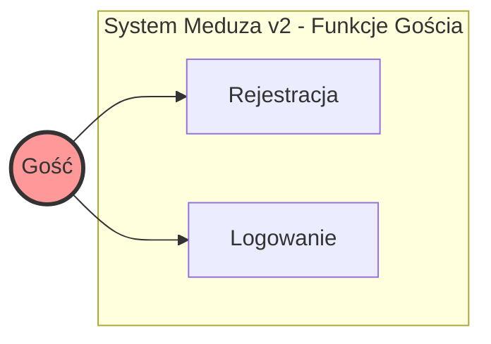
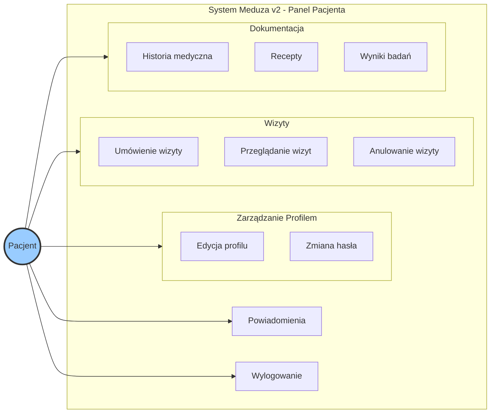
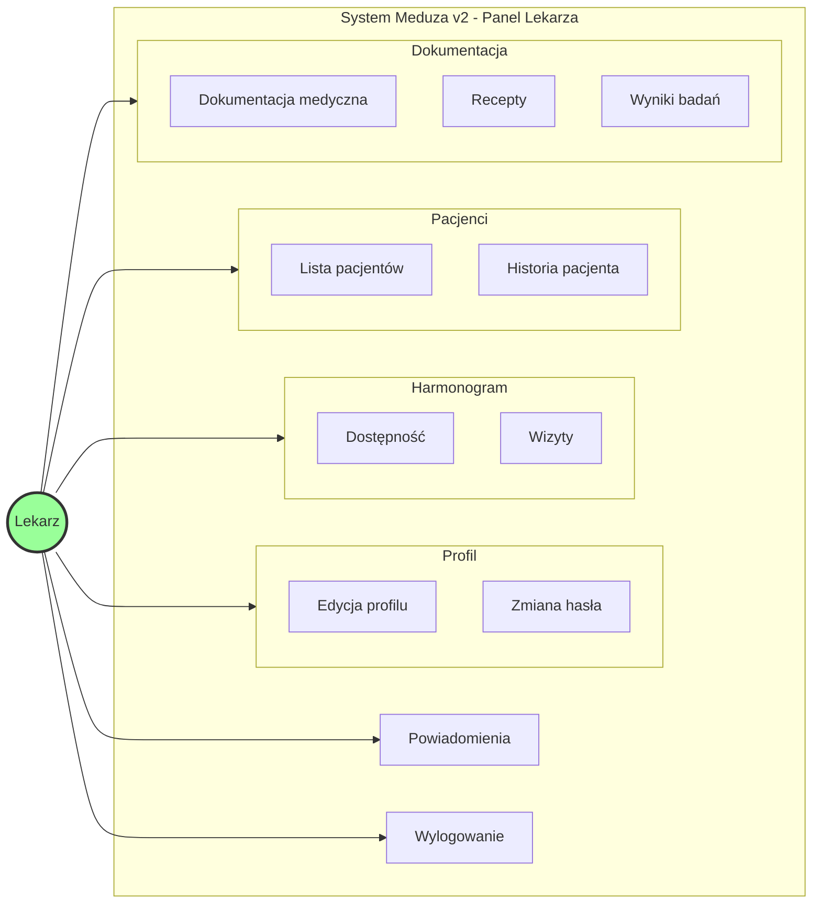

# Diagram UML - System Meduza v2

## Diagram 1: Przypadki użycia dla Gościa

## Diagram 2: Przypadki użycia dla Pacjenta

## Diagram 3: Przypadki użycia dla Lekarza

## Legenda

### Aktorzy:
- **Gość** - Niezalogowany użytkownik (może się rejestrować i logować)
- **Pacjent** - Zalogowany użytkownik z rolą "patient"
- **Lekarz** - Zalogowany użytkownik z rolą "doctor"

### Moduły systemu:

#### 1. Moduł Autoryzacji
- Rejestracja nowych użytkowników
- Logowanie do systemu
- Wylogowanie z systemu

#### 2. Zarządzanie Profilem
- Przeglądanie i edycja danych osobowych
- Zmiana hasła
- Upload avatara
- Uzupełnianie danych medycznych (dla pacjentów)

#### 3. Funkcje Pacjenta
- Przeglądanie dostępnych lekarzy i specjalizacji
- Rezerwacja wizyt lekarskich
- Przeglądanie nadchodzących i historycznych wizyt
- Anulowanie zarezerwowanych wizyt
- Dostęp do dokumentacji medycznej, recept i wyników badań

#### 4. Funkcje Lekarza
- Ustawianie dostępności (godziny pracy)
- Zarządzanie listą pacjentów
- Przeglądanie i zarządzanie wizytami
- Tworzenie dokumentacji medycznej po wizycie
- Wystawianie recept i dodawanie wyników badań
- Dostęp do pełnej historii medycznej pacjenta

#### 5. System Powiadomień
- Powiadomienia o nowych wizytach, anulacjach, receptach itp.
- Zarządzanie ustawieniami powiadomień

### Relacje między przypadkami użycia:
- **include** - przypadek użycia zawsze wymaga innego (np. umówienie wizyty wymaga wyboru lekarza)
- **extend** - przypadek użycia opcjonalnie rozszerza inny (np. historia medyczna może zawierać recepty)

---

**Źródło**: Opracowanie własne na podstawie struktury systemu Meduza v2
